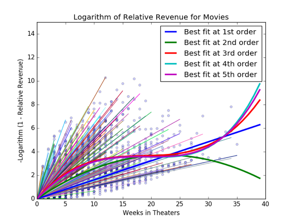

<h1>Movie Revenue Projections</h1>

Dear Studio Marketing Executives,

You will be hearing from many presenters suggesting ways to predict movie revenue based on properties of the movie. But to see if the predictions turn out to be true will take several weeks, and by then it may be too late! Thus I would like to present some work that I have been doing to predict movie revenues based on the first few weeks’ return. This prediction is based on the weekly evolution of the revenue.

<h2>Movie Revenue Model:
 Exponentially Decaying Viewers</h2>

When a movie is released, sales usually start out strong then attract less viewers as time goes by. Eventually there are so few new viewers that the studio pulls the movie from theaters. The revenue versus week appears to fit an exponential curve of the form:

Figure 1 shows an example; this is not unusual, this is literally the first movie considered. We can get a better estimate of how exponential the revenue is by re-writing this as

An exactly exponential revenue curve will then yield a straight line with slope lambda. For this example,

meaning that each week gets only 56% of the previous week’s viewers.

<h2>Why is this Important?</h2>

If this exponential behavior is universal, the total revenue a movie will produce could be estimated from just the first weekend’s revenue, using an average decay:

Knowing two weeks’ revenues allows you to calculate the decay constant for that movie, letting you be much more accurate. This can help you adjust advertising strategies, timing of releases, etc. If it becomes clear that a movie will not meet its revenue goal, it can be pulled from theaters early. If a particular factor (timing of release, genre, number of theaters, etc.) is found to be important, this can influence which movies to make.

<h2>Part I: Best Fit Per Movie</h2>
<h3>A. Decay Constant for Each Movie</h3>
Scape movie information from BoxOfficeMojo.com
<ul>
<li>Total domestic revenue, and weekly revenues</li>
<li>Details such as genre, release date, theater openings, actors, director, etc.</li>
</ul>
Sampled 2,500 movies
Decay constant:
 median ~ 0.43/week,
 mean ~ 0.58/week

<h3>B: By Movie Type</h3>
We can also study the decay rates as a function of the type of movie

Decay rates by movie type show large variation: Documentary and Foreign films are sharply peaked near
lambda ~ 0.4, others are more spread out.

<h3>C: By Season</h4>
We can also study the decay rates as a function of the season:
<ul>
<li>Summer (June, July, August)</li>
<li>Winter (December)</li>
<li>Other</li>
</ul>

There did not seem to be significant variation with season.

Summary for Part I: Knowing one week’s revenue can give you an estimate of the total revenue, assuming an average decay constant. This constant depends upon genre and possibly other factors.

But there are several problems with this approach:
<ul>
<li>Treats each movie with equal weight, even though some movies have several data points and others only one</li>
<li>Does not give Goodness-of-Fit diagnostic</li>
<li>Hard to generalize to more sophisticated models</li>
</ul>

<h2>Part II: Linear Regression Analysis</h2>

Let’s find a single exponential decay model to best represent all revenue data points. First we fit training data to curve of the form

Once we trust our results are robust, can generalize to higher-order terms in equation for better fit.

<h3>A: Simple Exponential Fit</h3>
For a curve of this form, with Lasso regularization coefficient

The best fit is

Note that this is lower than might be expected, because slowly-decaying movies last longer and thus have more data points; gives rise to bias. The Mean training error: 2.38, and Mean testing error: 2.54
 (2:1 ratio of data)

<h3>B: Higher-order Modeling?</h3>

We would like to generalize this to a more sophisticated model which incorporates this behavior, of the form

This simply means fitting to a curve of this form:

Results at 5th Order show a Mean training error of 2.29 and Mean testing error of 2.27.

<h2>Conclusion and Future Plans</h2>
Generalized exponential decay curve of the form

which can be used to accurately predict weekly movie revenues based on the first week:

Later I plan to fit these coefficients to categories of movies.

Thank you for your attention!
